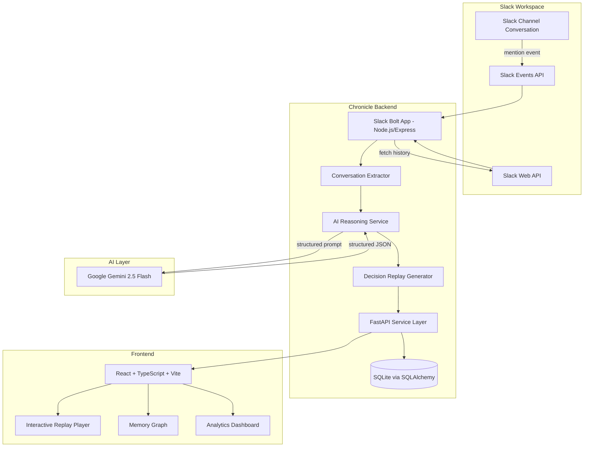
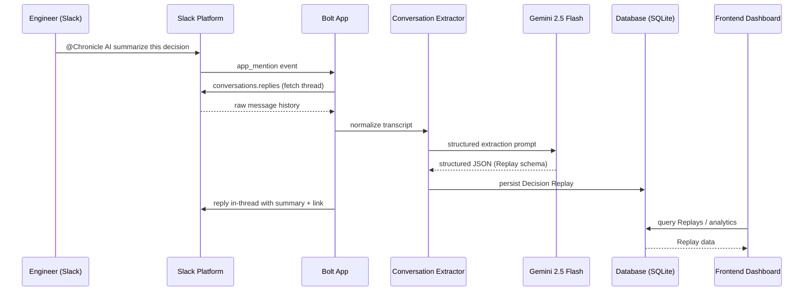

<div align="center">

# 🧠 Chronicle AI

### AI-Powered Organizational Memory for Slack

**Chronicle AI turns scattered Slack conversations into searchable, replayable organizational reasoning — so no team ever has to ask "wait, why did we decide this?" again.**

[](https://opensource.org/licenses/Apache-2.0)
[](https://slack.dev/bolt-js)
[](https://ai.google.dev)
[](https://fastapi.tiangolo.com/)
[](https://react.dev)
[](https://vitejs.dev)
[](#contributing)

<br/>


<sub>📽️ <em>Animated product demo GIF — placeholder (insert `docs/media/demo.gif`)</em></sub>

</div>

<br/>

---

## Table of Contents

- [Why Chronicle AI Exists](#why-chronicle-ai-exists)
- [Features](#features)
  - [1. Slack AI Agent](#1-slack-ai-agent)
  - [2. Decision Replay](#2-decision-replay)
  - [3. Interactive Replay Player](#3-interactive-replay-player)
  - [4. Memory Graph](#4-memory-graph)
  - [5. Analytics Dashboard](#5-analytics-dashboard)
  - [6. Settings](#6-settings)
- [Screenshots](#screenshots)
- [Demo Walkthrough](#demo-walkthrough)
- [Architecture](#architecture)
- [How Chronicle Works](#how-chronicle-works)
- [AI Pipeline](#ai-pipeline)
- [Dashboard Walkthrough](#dashboard-walkthrough)
- [Folder Structure](#folder-structure)
- [Installation Guide](#installation-guide)
- [Deployment Guide](#deployment-guide)
- [API Documentation](#api-documentation)
- [Environment Variables](#environment-variables)
- [Security](#security)
- [Performance](#performance)
- [Challenges We Faced](#challenges-we-faced)
- [Engineering Decisions](#engineering-decisions)
- [Chronicle vs Traditional Slack Search](#chronicle-vs-traditional-slack-search)
- [Roadmap](#roadmap)
- [FAQ](#faq)
- [Contributing](#contributing)
- [License](#license)
- [Acknowledgements](#acknowledgements)

---

## Why Chronicle AI Exists

Every engineering team eventually hits the same wall.

A decision gets made in a Slack thread — maybe about migrating a service, dropping a library, or changing an API contract. At the time, everyone in the room understands the reasoning. Six months later, none of that reasoning is retrievable. The thread is buried under thousands of newer messages. The person who made the call has moved teams, or left the company. All that's left is the *outcome* of the decision, stripped of the *why*.

Slack's native search makes this worse, not better. Search finds **keywords**, not **reasoning**. It can locate a message that contains the word "Postgres," but it cannot tell you:

- What alternatives were considered and rejected
- Who raised the strongest counterargument, and what it was
- What trade-offs the team knowingly accepted
- How confident the team actually was in the decision
- What the business impact of the decision was expected to be

This is **organizational memory loss**, and it compounds. Every new hire re-litigates decisions the team already made. Every retro rediscovers constraints the team already knew. Every architecture review re-asks questions that were already answered — because the answers were never structured, only spoken.

Chronicle AI exists to fix this at the source. Instead of treating Slack as a firehose of ephemeral messages, Chronicle treats it as a stream of **organizational reasoning events**. It listens for decision-shaped conversations, uses Google Gemini to reconstruct the structure of the discussion — problem, proposal, arguments, alternatives, decision, trade-offs — and turns that structure into a permanent, searchable, replayable artifact.

The result isn't a transcript. It's a **Decision Replay**: a compressed, faithful reconstruction of how and why your team thinks, available forever, to everyone, without anyone needing to remember to write it down.

---

## Features

### 1. Slack AI Agent

**Overview**
Chronicle AI ships as a native Slack app built on Slack's Bolt framework. It listens for `app_mention` events and slash-command invocations, reads back through the relevant channel history, and responds directly inside the thread.

**Why it exists**
Teams already live in Slack. Asking engineers to switch tools to document decisions guarantees the documentation never happens. Chronicle meets the team where the conversation already is.

**Benefits**
- Zero context-switching — invoked with a simple `@Chronicle AI` mention
- Understands multi-person, multi-turn discussions, not just single messages
- Responds in-thread, so the summary lives next to the conversation it describes

**Technical implementation**
Built with the Slack Bolt SDK and the Slack Events API. On mention, the agent fetches surrounding conversation history via the Slack Web API (`conversations.replies` / `conversations.history`), reconstructs a clean transcript (resolving user IDs to display names, stripping bot noise), and forwards that transcript to the AI Reasoning Service.

**Use Cases**
- `@Chronicle AI summarize this decision`
- `@Chronicle AI what did we decide about the API versioning?`
- `@Chronicle AI generate an ADR from this thread`

---

### 2. Decision Replay

**Overview**
The core artifact Chronicle produces. Instead of a plain summary, a Decision Replay is a structured extraction of the discussion's actual reasoning shape.

**Why it exists**
A one-line summary ("we decided to use Go") destroys exactly the information future engineers need. A Decision Replay preserves it.

**Benefits**
Every Replay includes:

| Field | Description |
|---|---|
| **Problem Statement** | The underlying issue that triggered the discussion |
| **Proposal** | The specific solution being suggested |
| **Supporting Arguments** | Reasoning offered in favor, attributed to participants |
| **Counterarguments** | Objections and concerns raised during the discussion |
| **Alternatives Considered** | Other options discussed and why they were set aside |
| **Decision** | The final outcome the team converged on |
| **Business Impact** | Anticipated effect on users, cost, or velocity |
| **Trade-offs** | Known downsides the team accepted knowingly |
| **Confidence Score** | Gemini's estimate of how firmly the team committed |

**Technical implementation**
The transcript is passed to Gemini 2.5 Flash with a structured extraction prompt. The model returns a strict JSON schema matching the fields above, which is validated, persisted via SQLAlchemy into SQLite, and indexed for full-text and semantic retrieval.

**Use Cases**
- Onboarding new engineers onto a legacy system
- Architecture reviews revisiting old trade-offs
- Postmortems tracing a decision back to its original reasoning

---

### 3. Interactive Replay Player

**Overview**
A timeline-based UI for stepping through a Decision Replay the way you'd scrub through a video.

**Why it exists**
Reading a wall of extracted text is still cognitively heavy. Chronicle lets you *play back* a decision step by step, the way it actually unfolded.

**Benefits**
- Timeline playback with adjustable **playback speed**
- Step-by-step reasoning reveal (problem → arguments → decision)
- One-click **ADR generation** from any point in the replay
- Shareable replay links for async review

**Technical implementation**
Built in React + Framer Motion for the timeline transitions. Replay state is driven by a finite sequence of "reasoning steps" derived from the Gemini extraction, each with its own timestamp anchor back to the original Slack thread.

**Use Cases**
- Presenting a decision's rationale in a design review
- Auditing how a decision evolved across a long thread

---

### 4. Memory Graph

**Overview**
A visual, explorable graph connecting Projects, People, Channels, and Decisions.

**Why it exists**
Decisions don't exist in isolation — the same person tends to push similar architectural preferences, and the same project tends to accumulate related decisions. The Memory Graph makes those relationships visible.

**Benefits**
- Discover which engineers influence which categories of decisions
- Trace how a single project's architecture evolved decision-by-decision
- Spot channels that generate disproportionate architectural discussion

**Technical implementation**
Nodes and edges are derived from Replay metadata (participants, channel, linked project tags) and rendered as an interactive force-directed graph in the frontend.

**Use Cases**
- Understanding team dynamics before a reorg
- Mapping ownership before a migration

---

### 5. Analytics Dashboard

**Overview**
Aggregate statistics and trends across every Replay Chronicle has ever generated.

**Why it exists**
Individual replays answer "why did we decide X." The dashboard answers "how does this team decide things, in general."

**Benefits**
- Replay volume over time
- Average confidence score trends
- Most active decision-makers and channels
- Categories of decisions (infra, API design, tooling, process)

**Technical implementation**
Computed from the SQLite-backed Replay table via aggregate queries, served through FastAPI, and rendered with charting components on the React dashboard.

**Use Cases**
- Engineering leadership retros
- Identifying decision bottlenecks

---

### 6. Settings

**Overview**
A dedicated configuration surface for connecting Chronicle to your workspace.

**Why it exists**
Chronicle needs to be safely and explicitly configured per-workspace, without hardcoding secrets into the codebase.

**Benefits**
- Guided Slack app + bot token setup
- Gemini API key configuration
- Visibility into which channels Chronicle is actively monitoring

**Technical implementation**
Reads and writes to environment-scoped configuration, validated by the FastAPI backend before being persisted.

---

## Screenshots

<div align="center">

| Dashboard | Slack Agent |
|---|---|
|  |  |

| Decision Replay Player | Memory Graph |
|---|---|
|  |  |

| Analytics | System Architecture |
|---|---|
|  |  |

</div>

---

## Demo Walkthrough

A real engineering discussion, as it might unfold in a `#backend` channel:

> **Diya**: Should we migrate reporting to Go?
>
> **Kev**: Latency is becoming a bottleneck on the current service.
>
> **Satish**: Go would reduce serialization costs compared to what we're doing now.
>
> **Diya**: @Chronicle AI summarize this decision

The moment Chronicle is mentioned, the agent:

1. **Fetches** the surrounding thread via the Slack Web API
2. **Resolves** each speaker's identity and reconstructs a clean transcript
3. **Sends** the transcript to Gemini 2.5 Flash with a structured extraction prompt
4. **Receives** a JSON object containing the problem statement, proposal, supporting arguments, counterarguments, alternatives, decision, business impact, trade-offs, and a confidence score
5. **Persists** the Replay to SQLite and **replies in-thread** with a condensed summary and a link to the full Interactive Replay Player

The resulting Replay might read:

> **Problem:** Reporting service latency has degraded under load.
> **Proposal:** Migrate the reporting service to Go.
> **Supporting Arguments:** Reduced serialization overhead; better concurrency primitives for the current workload.
> **Alternatives Considered:** Optimizing the existing implementation without a rewrite.
> **Decision:** Proceed with a Go migration for the reporting service.
> **Confidence Score:** 78%

Six months later, a new engineer joining the backend team can open this Replay and understand *exactly* why reporting runs on Go — without ever asking in Slack.

---

## Architecture



**Layer breakdown**

- **Slack** — the source of truth for raw conversation. The Events API notifies Chronicle of mentions; the Web API lets Chronicle read surrounding context.
- **Backend (Node.js/Express + Slack Bolt)** — owns the Slack-facing surface: receiving events, verifying signatures, fetching history, and replying in-thread.
- **Backend (FastAPI + Python)** — owns the reasoning and persistence surface: orchestrating Gemini calls, validating structured output, and serving the REST API the frontend consumes.
- **Gemini 2.5 Flash** — performs the actual reasoning extraction, converting unstructured conversation into a structured Decision Replay schema.
- **SQLite via SQLAlchemy** — durable, zero-ops storage for Replays, Memory Graph edges, and analytics aggregates.
- **Frontend (React/TypeScript/Vite)** — renders the Interactive Replay Player, Memory Graph, and Analytics Dashboard, styled with Tailwind CSS and animated with Framer Motion.

---

## How Chronicle Works



**Pipeline stages**

1. **Slack Event** — an `app_mention` triggers the Bolt app's event handler.
2. **Conversation Extraction** — thread history is fetched, cleaned, and speaker identities resolved.
3. **Gemini Reasoning** — the transcript is sent to Gemini 2.5 Flash with a schema-constrained extraction prompt.
4. **Replay Generation** — validated structured output becomes a Decision Replay record.
5. **Storage** — the Replay, along with derived Memory Graph edges, is persisted to SQLite.
6. **Dashboard** — the frontend queries the FastAPI layer to render the Replay Player, Memory Graph, and Analytics views.

---

## AI Pipeline

**Conversation Parsing**
Raw Slack messages are stripped of formatting artifacts, threaded replies are flattened into chronological order, and user IDs are resolved to display names via the Slack Web API.

**Reasoning**
Gemini 2.5 Flash is prompted with the cleaned transcript and an explicit instruction to reconstruct the discussion's argumentative structure — not just summarize it.

**Decision Extraction**
The model returns a structured JSON object conforming to the Decision Replay schema (problem, proposal, arguments, counterarguments, alternatives, decision, impact, trade-offs).

**Confidence Score**
Gemini estimates how firmly the team committed to the decision, based on linguistic signals of certainty, dissent, and consensus within the thread.

**ADR Generation**
On request, a Replay can be reformatted into a standard Architecture Decision Record (ADR) template, ready to commit to a repository's `/docs/adr` directory.

**Future Improvements**
- Multi-thread reasoning (stitching together a decision discussed across several channels/days)
- Fine-tuned confidence calibration against historical outcomes
- Support for additional LLM backends beyond Gemini

---

## Dashboard Walkthrough

**Dashboard** — the landing view, showing recent Replays, workspace-wide activity, and quick links into deeper views.

**Decision Replay** — the detail view for a single Replay, including the Interactive Replay Player and one-click ADR export.

**Memory Graph** — the relationship explorer connecting people, projects, channels, and decisions.

**Analytics** — aggregate charts on Replay volume, confidence trends, and top contributors/channels.

**Settings** — Slack and Gemini configuration, plus visibility into monitored channels.

---

## Folder Structure

```
chronicle-ai/
├── backend/
│   ├── slack-app/            # Node.js + Express + Slack Bolt app (event ingestion)
│   ├── reasoning-service/    # FastAPI service orchestrating Gemini calls
│   ├── models/               # SQLAlchemy models for Replays, Graph edges, Analytics
│   └── db/                   # SQLite database + migrations
├── frontend/
│   ├── src/
│   │   ├── components/       # Replay Player, Memory Graph, Analytics widgets
│   │   ├── pages/            # Dashboard, Replay, Graph, Analytics, Settings views
│   │   └── lib/               # API client, types, utilities
│   └── vite.config.ts
├── docs/
│   └── media/                 # Screenshots, demo GIFs
├── .env.example
└── README.md
```

Each top-level folder maps directly to a layer in the architecture diagram above — `backend/slack-app` owns Slack I/O, `backend/reasoning-service` owns the Gemini pipeline, and `frontend` owns everything the user sees.

---

## Installation Guide

### Prerequisites
- Node.js 18+
- Python 3.10+
- A Slack workspace where you can install a custom app
- A Google Gemini API key

### 1. Clone the repository

```bash
git clone https://github.com/DiyaMenon/chronicle-ai.git
cd chronicle-ai
```

### 2. Backend — Slack App (Node.js)

```bash
cd backend/slack-app
npm install
cp .env.example .env
# fill in SLACK_BOT_TOKEN, SLACK_SIGNING_SECRET, SLACK_APP_TOKEN
npm run dev
```

### 3. Backend — Reasoning Service (FastAPI)

```bash
cd backend/reasoning-service
python -m venv venv
source venv/bin/activate
pip install -r requirements.txt
cp .env.example .env
# fill in GEMINI_API_KEY, DATABASE_URL
uvicorn main:app --reload --port 8000
```

### 4. Frontend

```bash
cd frontend
npm install
npm run dev
```

### 5. Slack App Configuration

1. Create a new Slack app at [api.slack.com/apps](https://api.slack.com/apps)
2. Enable **Event Subscriptions** and subscribe to `app_mention`
3. Add the **bot token scopes**: `app_mentions:read`, `channels:history`, `chat:write`, `users:read`
4. Install the app to your workspace and copy the Bot Token into your `.env`

### 6. Running Locally

With all three services running (`slack-app`, `reasoning-service`, `frontend`), invite the Chronicle bot into a channel and mention it in a thread to trigger your first Replay.

---

## Deployment Guide

| Component | Recommended Platform | Notes |
|---|---|---|
| Slack App (Node.js) | Render / Railway | Needs a persistent HTTPS endpoint for Slack Events API |
| Reasoning Service (FastAPI) | Render | Configure `GEMINI_API_KEY` as a secret environment variable |
| Frontend (Vite/React) | Vercel | Set `VITE_API_BASE_URL` to the deployed FastAPI URL |
| Database | SQLite (file-backed) | Fine for hackathon/small-team scale; see [Performance](#performance) for scaling notes |

**Production recommendations**
- Terminate TLS at the platform edge (Render/Vercel handle this automatically)
- Rotate Slack signing secrets and bot tokens periodically
- Move from SQLite to Postgres once concurrent write volume grows (see [Roadmap](#roadmap))
- Set up structured logging around Gemini calls to monitor latency and failure rates

---

## API Documentation

Base URL: `https://<your-deployment>/api`

### `GET /replays`
Returns a paginated list of all Decision Replays.

**Response**
```json
{
  "replays": [
    {
      "id": "rep_1a2b3c",
      "problem_statement": "Reporting service latency degraded under load",
      "decision": "Migrate reporting service to Go",
      "confidence_score": 0.78,
      "created_at": "2026-06-01T10:15:00Z"
    }
  ],
  "page": 1,
  "total": 42
}
```

### `GET /replays/{id}`
Returns full detail for a single Replay, including arguments, alternatives, and trade-offs.

### `POST /replays/generate`
Triggers Replay generation from a raw transcript (used internally by the Slack app).

**Request**
```json
{
  "channel_id": "C0123456",
  "thread_ts": "1717236900.000200",
  "transcript": "Diya: Should we migrate reporting to Go?\nKev: Latency is becoming a bottleneck.\n..."
}
```

**Response**
```json
{
  "id": "rep_1a2b3c",
  "status": "created"
}
```

### `GET /replays/{id}/adr`
Returns the Replay reformatted as a Markdown ADR document.

### `GET /graph`
Returns Memory Graph nodes and edges (people, projects, channels, decisions).

### `GET /analytics/summary`
Returns aggregate stats: total Replays, average confidence, top contributors, top channels.

### `GET /health`
Basic liveness check for deployment monitoring.

---

## Environment Variables

| Variable | Used By | Description |
|---|---|---|
| `SLACK_BOT_TOKEN` | Slack App | Bot user OAuth token for posting messages and reading history |
| `SLACK_SIGNING_SECRET` | Slack App | Verifies that incoming requests genuinely originate from Slack |
| `SLACK_APP_TOKEN` | Slack App | Enables Socket Mode for local development |
| `GEMINI_API_KEY` | Reasoning Service | Authenticates requests to the Google Gemini API |
| `DATABASE_URL` | Reasoning Service | SQLAlchemy connection string (defaults to local SQLite file) |
| `VITE_API_BASE_URL` | Frontend | Base URL the frontend uses to call the FastAPI backend |
| `PORT` | Both backends | Port each service listens on |

---

## Security

- **Slack tokens** are never committed to source control; `.env` is git-ignored and `.env.example` contains placeholders only
- **Request verification** — every incoming Slack event is validated against `SLACK_SIGNING_SECRET` before processing
- **Secrets management** — production deployments store all keys as platform-level environment secrets, never in code
- **Least privilege** — the Slack bot requests only the scopes it needs (`app_mentions:read`, `channels:history`, `chat:write`, `users:read`)
- **API key isolation** — the Gemini API key is only ever accessible from the backend reasoning service, never exposed to the frontend

---

## Performance

- **SQLite** is well-suited to Chronicle's current read-heavy, moderate-write workload, and requires zero operational overhead
- **FastAPI** provides async request handling, keeping Gemini calls from blocking other API traffic
- **Gemini 2.5 Flash** was chosen specifically for its low latency relative to larger reasoning models, keeping in-thread reply times fast
- **Caching** — repeated Replay reads (e.g., dashboard polling) are served from indexed SQLite queries rather than recomputing extraction
- **Scaling** — as workspace size grows, the migration path is SQLite → Postgres, with the SQLAlchemy layer requiring no application-level rewrite

---

## Challenges We Faced

**Slack Events reliability**
Slack retries event delivery on any handler timeout, which initially caused duplicate Replay generation. Solved with idempotency keys keyed on `channel_id` + `thread_ts`.

**Replay generation consistency**
Early prompts produced inconsistent JSON shapes from Gemini. Solved by tightening the extraction prompt with an explicit schema and rejecting/retrying malformed responses.

**Reasoning quality on short threads**
Very short threads (2–3 messages) sometimes lacked enough signal for a meaningful confidence score. Addressed by having Gemini explicitly flag low-signal Replays rather than force a score.

**Frontend synchronization**
Keeping the Interactive Replay Player timeline in sync with asynchronously-loaded Replay data required careful state management in React to avoid flicker on slow connections.

**Deployment across three services**
Coordinating environment variables and startup order across the Slack app, reasoning service, and frontend required a clear `.env.example` and deployment runbook for each platform.

---

## Engineering Decisions

**Why React?**
Component-driven UI made it straightforward to build the Replay Player, Memory Graph, and Analytics views as independently testable pieces, and its ecosystem (Framer Motion, charting libraries) covered every visualization need.

**Why FastAPI?**
Native async support and automatic OpenAPI schema generation made it a natural fit for a service whose main job is orchestrating latency-sensitive Gemini calls.

**Why SQLite?**
Zero operational overhead for a hackathon-stage project, while SQLAlchemy keeps a clean migration path to Postgres as usage scales.

**Why Gemini?**
Gemini 2.5 Flash offered the best balance of reasoning quality and latency for a chat-adjacent, near-real-time use case, at a lower cost profile than larger frontier models.

**Why Slack Bolt?**
Bolt abstracts away the boilerplate of event verification and OAuth, letting the team focus on conversation extraction and reasoning rather than Slack plumbing.

---

## Chronicle vs Traditional Slack Search

| Capability | Slack Search | Chronicle AI |
|---|---|---|
| Finds keyword matches | ✅ | ✅ |
| Understands *why* a decision was made | ❌ | ✅ |
| Surfaces rejected alternatives | ❌ | ✅ |
| Attributes arguments to specific people | ❌ | ✅ |
| Produces a reusable ADR | ❌ | ✅ |
| Shows organization-wide decision trends | ❌ | ✅ |
| Works after the original thread is buried | ❌ | ✅ |
| Requires manual documentation effort | ❌ (search is passive) | ❌ (fully automatic) |

---

## Roadmap

**Immediate**
- Multi-workspace support
- Improved ADR export formatting (Markdown + Confluence)

**3 Months**
- Postgres migration path for larger workspaces
- Slash-command driven Replay search (`/chronicle find <topic>`)

**6 Months**
- Cross-thread reasoning stitching for decisions discussed over multiple sessions
- Team-level confidence calibration based on historical decision outcomes

**12 Months**
- Native integrations with GitHub (linking Replays to PRs) and Linear/Jira (linking Replays to tickets)
- Fine-tuned extraction models trained on anonymized organizational data

**Enterprise Vision**
Chronicle AI as the default organizational memory layer for engineering teams — every architectural decision, anywhere it's discussed (Slack, GitHub, Linear), automatically captured, structured, and searchable across the company's entire history.

---

## FAQ

**1. What exactly does Chronicle AI capture?**
Any Slack conversation where Chronicle is mentioned, along with the surrounding thread context needed to understand the discussion.

**2. Does Chronicle read every message in my workspace?**
No. It only processes threads where it is explicitly mentioned, or channels you've configured it to monitor.

**3. What LLM powers the reasoning?**
Google Gemini 2.5 Flash.

**4. Can I self-host Chronicle?**
Yes — the entire stack (Slack app, reasoning service, frontend) is designed to be self-hosted on Render, Railway, or Vercel.

**5. Is my data sent anywhere besides Gemini?**
No. Transcripts are sent only to the Gemini API for extraction and are otherwise stored in your own database.

**6. What happens if Gemini returns malformed output?**
The reasoning service validates the response against a strict schema and retries generation if validation fails.

**7. Can Chronicle generate a formal ADR?**
Yes — any Replay can be exported as a Markdown Architecture Decision Record.

**8. Does Chronicle work with private channels?**
Yes, as long as the bot has been invited to the channel and granted the appropriate scopes.

**9. How is the confidence score calculated?**
Gemini estimates it from linguistic signals of certainty, consensus, and dissent present in the thread.

**10. What database does Chronicle use?**
SQLite by default, via SQLAlchemy, with a straightforward migration path to Postgres.

**11. Can I run the frontend without the Slack app?**
Yes, for browsing existing Replays, though new Replays require the Slack app to be running.

**12. Does Chronicle support threads spanning multiple days?**
Not yet — this is on the roadmap as cross-thread reasoning stitching.

**13. Is there a slash command in addition to mentions?**
Slash-command search is planned for the near-term roadmap.

**14. What Slack scopes does the bot need?**
`app_mentions:read`, `channels:history`, `chat:write`, and `users:read`.

**15. Can Chronicle summarize non-decision conversations?**
It's optimized for decision-shaped discussions, but can produce a general summary for any thread it's mentioned in.

**16. How does the Memory Graph decide relationships?**
From Replay metadata — shared participants, channels, and project tags across Replays.

**17. Is Chronicle open source?**
Yes, licensed under Apache 2.0.

**18. Can I contribute a new integration (e.g., GitHub)?**
Absolutely — see the [Contributing](#contributing) section.

**19. What happens to Replays if I uninstall the Slack app?**
Existing Replays remain in your database; only new Replay generation stops.

**20. Does Chronicle work with Slack Enterprise Grid?**
Multi-workspace and Enterprise Grid support are on the roadmap.

---

## Contributing

Contributions are welcome and appreciated.

1. Fork the repository
2. Create a feature branch: `git checkout -b feature/your-feature`
3. Make your changes, with tests where applicable
4. Ensure the backend (`pytest`) and frontend (`npm run lint`) checks pass
5. Open a pull request describing the change and its motivation

Please open an issue first for any significant feature or architectural change, so it can be discussed before implementation work begins.

---

## License

Chronicle AI is licensed under the **Apache License 2.0**. See [`LICENSE`](./LICENSE) for the full text.

---

## Acknowledgements

- **Slack** — for the Bolt SDK and Events API that make real-time conversational integration possible
- **Google** — for Gemini 2.5 Flash, the reasoning engine at Chronicle's core
- **FastAPI** — for a backend framework that made async AI orchestration straightforward
- **React** — for a component model well-suited to Chronicle's interactive Replay Player
- **SQLite** — for zero-ops persistence during early-stage development
- **The Open Source Community** — for the tools and libraries this project stands on

<div align="center">

<br/>

**Chronicle AI — because reasoning shouldn't disappear the moment a thread scrolls away.**

</div>
